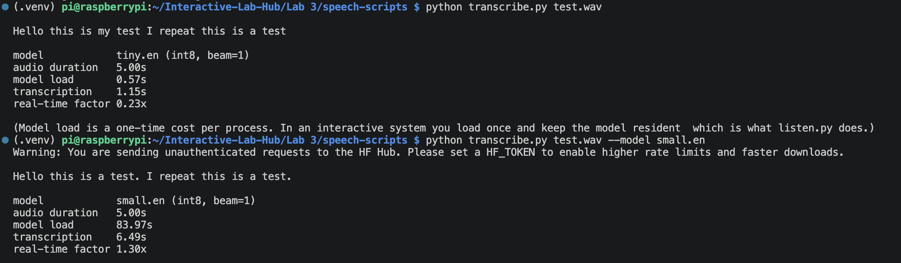
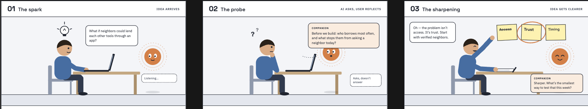
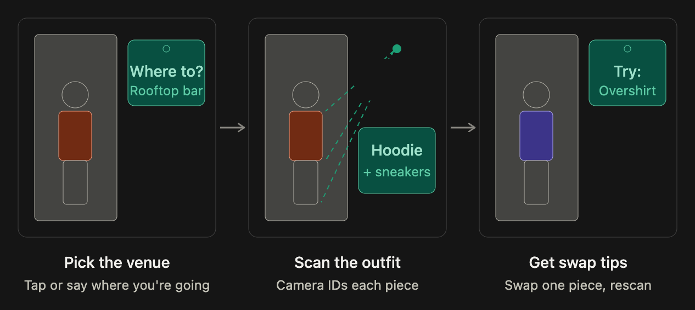

# Chatterboxes — Lab 3

**Elliot Waxman**

A speech-enabled device built on the Raspberry Pi. Part 1 is a voice "thinking
partner"; Part 2 pivots to a **camera stylist** that gives spoken feedback on your
outfit. All the speech processing runs on the Pi; only the Claude-powered devices
make a network call, and only to the Claude API. Code and a full walkthrough:
[speech-scripts/CODE_OVERVIEW.md](speech-scripts/CODE_OVERVIEW.md).

---

# Part 1

## A. Text to Speech

**Greeting script:** [speech-scripts/elliot.sh](speech-scripts/elliot.sh) has the
Pi greet me by name (Piper voice).

**Is the same greeting, in these different voices, the same greeting?**

It's the same words, but not quite the same greeting. `festival` is clearly more
human-sounding than `espeak` — compared to the robotic formant voice, it at least
has intonation — and Piper is the closest to an actual person. That changes *who*
seems to be speaking: the same greeting from `espeak` sounds like a machine
announcing itself, while from Piper it sounds like a person actually greeting you,
which turns it from a notification into a greeting.

## B. Speech to Text

**Model size vs. latency** — measured on a 5.0s recording of my own speech on the Pi:

| Model | Transcription time | Real-time factor |
|---|---|---|
| tiny.en  | 0.96s | 0.19× |
| base.en  | 2.12s | 0.42× |
| small.en | 5.95s | 1.19× |

For my use case the accuracy gains stop being worth the delay quickly. The
transcript feeds into a language model (Claude), which understands the context
even when a word or two is transcribed wrong, so I don't actually need highly
accurate transcription — a smaller, faster model is good enough. `tiny.en` and
`base.en` both keep up comfortably (faster than real time), while `small.en` runs
at 1.19×, *slower* than real time, which adds latency with no benefit I can use for
a device that has to answer me.

**Number prompt:** [speech-scripts/ask_number.py](speech-scripts/ask_number.py)
asks for a number out loud, transcribes and confirms it, and logs each attempt so
I can study the characteristic errors speech recognition makes on digit strings.

## C. Turn-taking (endpointing)

**How the silence threshold feels at 0.2s, 1.5s, and in between:**

I tried 0.2s, 1.5s, and about 0.8s in between. At **0.2s** the device cuts me off
constantly — any natural mid-sentence pause (taking a breath, thinking of the next
word) is read as the end of my turn, so it clips the ends of my thoughts and starts
replying before I'm done. It feels anxious and uncomfortable to talk to. At **1.5s**
it feels natural to stop and I'm never cut off, but the long wait before it reacts
makes the device seem slow and a little unsure whether it even heard me. Around
**0.8s** was the best balance for thinking out loud.

## D. Storyboard & design process

I wanted to talk through a difficult decision with an AI in a way that helps me
think for myself instead of just handing me advice. I've done this with Claude
before, but it never leaves me with an artifact — once the conversation is over,
it's gone. So a core requirement was that the conversation has to leave me with a
record: the device saves a transcript (`--log`) I can revisit. The storyboard is
built around that: you speak a problem out loud, the device reflects it back and
asks, and you're left with a saved record.

The pauses are a deliberate choice. From Part C I learned endpointing is a
parameter I have to set, so the device waits a generous beat (`--min-silence 0.9`,
longer than the echo bot's default) — thinking out loud has long pauses, and I
didn't want to be cut off mid-thought.

## E. Acting out the dialogue

**Did the dialogue differ from what I imagined?**

Yes. I tested the first iteration — a voice *life coach* — with a classmate named
**Demi**, and she was frustrated that it only asked more questions instead of
offering thoughtful, nuanced answers of its own. On paper the pure-questioning
approach seemed ideal, but in practice it felt withholding. I edited the system
prompt to offer more substantive responses, and ultimately pivoted the whole
concept for Part 2.

---

# Part 2 — Redesign

## Reflections

1. **Improvements.** The device hears people well, sees them well, and gives
   thoughtful commentary. The main thing to improve is responsiveness: it takes too
   long to reply, and during that wait it's unclear whether it's going to respond at
   all. A clearer loading state would help — the screen already turns its border
   purple while thinking, but making that read more obviously as "working on it" is
   the next step.
2. **Non-speech cues.** The MiniPiTFT screen is the main non-speech channel. In the
   stylist it shows a live camera preview (so you can see you're in frame) with a
   colored border for state: teal while listening, purple while thinking, orange
   while speaking. The thinking-partner version shows those same states as a
   reactive waveform whose height follows your voice, so you can see you're being
   heard. Either way you know whether it's listening or thinking without it having
   to tell you.
3. **New storyboard** for the stylist — pick the venue, scan the outfit, get swap
   tips (change one piece and rescan):

   

## The system: a camera stylist

You tell it where you're going and the vibe; it photographs your outfit from the
webcam and speaks feedback — what's working and one or two concrete changes for
that occasion — using Claude's vision. It runs on the Raspberry Pi and uses two
sensors: the USB microphone (speech in) and the webcam (vision). The pipeline is:
Silero VAD decides when my turn ends → faster-whisper transcribes it → the photo
plus what I said go to the Claude API with a stylist system prompt → Piper speaks
the reply. The screen shows the live camera feed with a state-colored border, and
it grabs a fresh frame every turn, so I can change my outfit, speak again, and get
feedback on what I'm wearing now. Code and a full walkthrough are in
[speech-scripts/outfit_check.py](speech-scripts/outfit_check.py) and
[speech-scripts/CODE_OVERVIEW.md](speech-scripts/CODE_OVERVIEW.md).

**Demo video:** https://youtube.com/shorts/N3zv_aD8Whs?is=c1aUxdiCkcHo1nLn

## Testing with users

I tested across the project's two iterations:

- **Demi** (classmate) tried the first iteration — the voice *life coach*. Her
  feedback was that she disliked how much it asked questions instead of giving
  thoughtful answers. That feedback drove the pivot to the stylist.
- **My girlfriend** tried the stylist. Wearing sweats, she said she was heading to
  the airport but wanted to look elegant; it suggested clean shoes and wide-legged
  tailored trousers, and she was pleased with the response.

### What worked well about the system and what didn't?

What worked: the feedback was specific, not generic — it was obvious the device was
using the actual outfit details captured from the camera (the airport/elegant
suggestion of clean shoes and wide-legged tailored trousers landed because it was
grounded in what she was actually wearing). What didn't: latency. It takes too long
to respond, and during the wait it's unclear whether a reply is even coming. A
loading state on the screen would help a lot.

### What worked well about the controller and what didn't?

My system is autonomous, so the "controller" is the Claude policy — the system
prompt that decides what it says. The first iteration was a life coach, and its
prompt made it ask more questions than it answered; Demi's feedback was that this
was frustrating, and it felt indistinguishable from a regular chat with Claude. So
I pivoted: the tool is now a stylist with a specific job — thoughtful feedback on
fashion choices tuned to the venue you're attending. That made the controller feel
purposeful instead of generic.

### What lessons can you take away from the WoZ interactions for designing a more autonomous version of the system?

The biggest lesson was about sensing over time. In the first version a single photo
was taken at the start, so the device couldn't give new feedback when someone
stepped back to show their full outfit. I iterated so it captures a fresh frame on
every turn (and shows a live preview on the screen), which makes it react to what
you're actually wearing now. For a more autonomous version the takeaway is that the
device has to keep perceiving throughout the interaction, not just sample once at
the beginning.

### How could you use your system to create a dataset of interaction? What other sensing modalities would make sense to capture?

The system could build a dataset of interactions by tagging each one with the
self-reported venue the outfit is for, a picture of the outfit, and the feedback the
tool gave. That triplet — context, image, response — is exactly what you'd need to
study the interaction or train on it later. Other sensing modalities worth
capturing: a distance or motion sensor to detect when someone steps back for a
full-length view (and trigger a capture at that moment), and ambient light to flag
when the photo conditions are too poor to judge an outfit.
